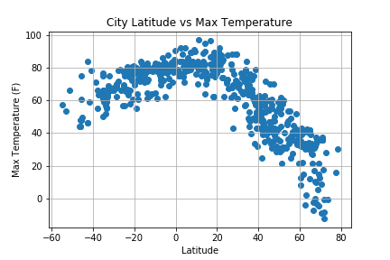
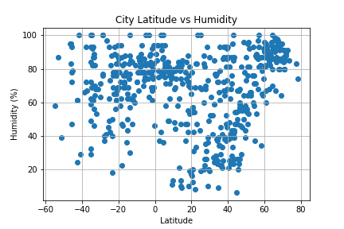
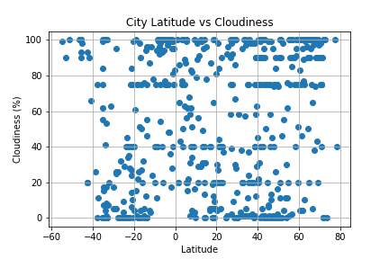
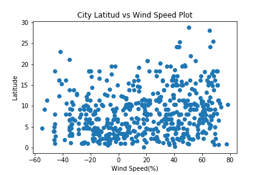

# Python-API-Challenge

### Description

Randomly select at least 500 unique (non-repeat) cities based on latitude and longitude to evaluate how weather changes as 
cities get closer to the equator. 

### Technologies

- Pandas
- Python
- Weather API (https://openweathermap.org/api)
- Matplotlib

### Tasks and Objectives
Build a series of scatter plots to showcase the following relationships:

- Temperature (F) vs. Latitude

- Humidity (%) vs. Latitude

- Cloudiness (%) vs. Latitude

- Wind Speed (mph) vs. Latitude

